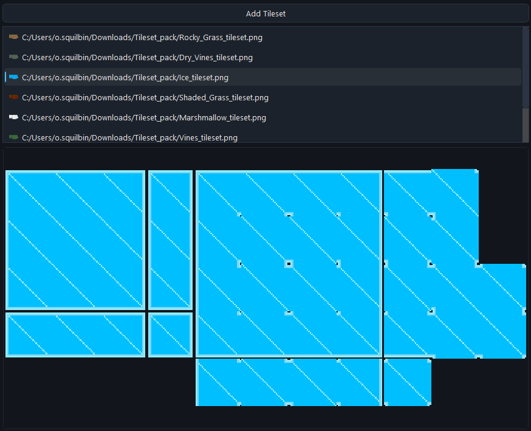
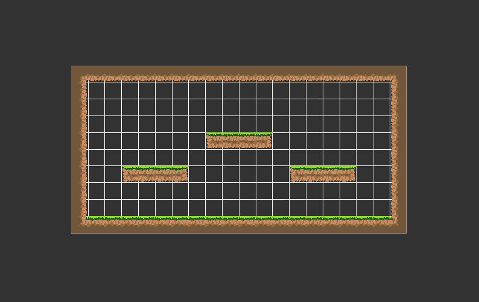
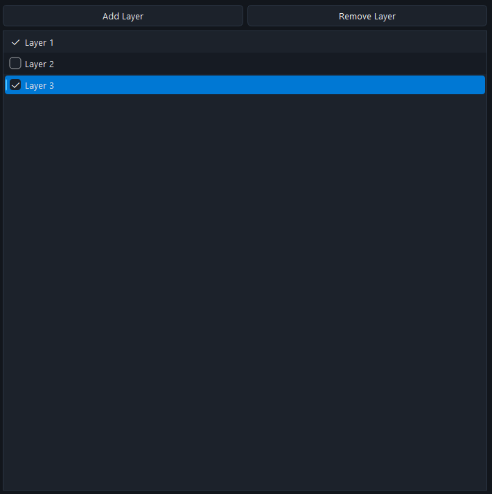
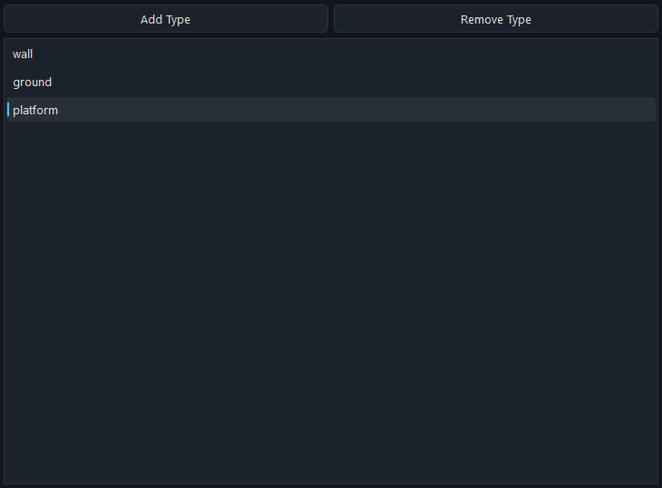
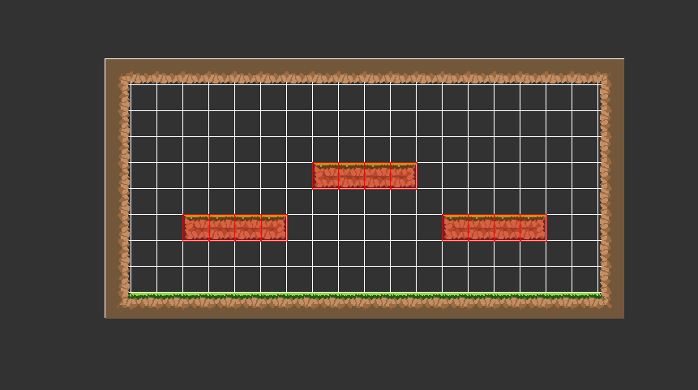

# Planetarium

Planetarium est une application intuitive pour créer et éditer des cartes 2D à l'aide de tuiles. Idéale pour les développeurs de jeux, les artistes numériques ou quiconque souhaite concevoir des environnements en 2D de manière simple et efficace.

## Fonctionnalités

- **Édition de cartes en grille** : Créez des cartes en plaçant des tuiles sur une grille flexible.
- **Palette de tuiles** : Sélectionnez parmi une variété de tuiles pour personnaliser vos créations.
- **Gestion des couches** : Organisez votre carte en plusieurs couches pour une meilleure structure.
- **Ajouter des tags** : Personnalisez vos tuiles avec des tags.

## Utilisation

Une fois l'application lancée :

1. **Choisir une tuile** : Cliquez sur une tuile dans la palette pour la sélectionner.
    
2. **Placer des tuiles** : Cliquez sur la grille de la carte pour placer la tuile sélectionnée à l'emplacement souhaité.
    
3. **Gérer les couches** : Utilisez le panneau des couches pour activer, désactiver ou réorganiser les couches de votre carte.
    
4. **Ajouter des tags** : Ajoutez des tags à vos tuiles pour spécifier leurs fonctionnements.
    
    

Planetarium est conçu pour être simple d'utilisation, permettant une création rapide et créative de cartes 2D.

## À propos

Planetarium a été développé par Owenn Squilbin, étudiant en deuxième année à Game Academy (2025 - 2026), dans le cadre de son projet de fin d'année intitulé "Lock Loop".

Ce projet fait partie du dépôt `planetarium` sur GitHub.